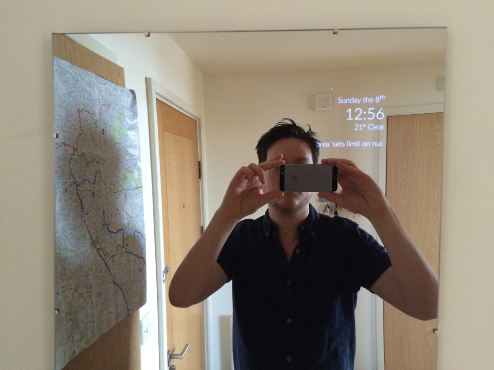

# HomeMirror
Android application powering the mirror in my flat

Features
====
* Day, time, and weather display
* Birthday messages
* Stock price swings
* Cryptocurrency prices
* Foreign exchange rates
* Next calendar event
* Top news headlines
* Face detection with mood detection

For more info on how to create your own smart mirror, see [the original project I forked from](https://github.com/HannahMitt/HomeMirror/blob/master/README.md#making-a-mirror)
